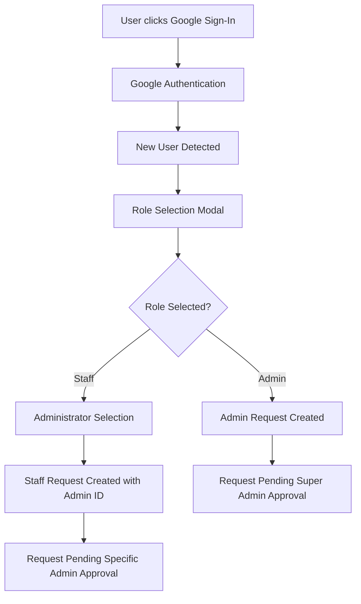
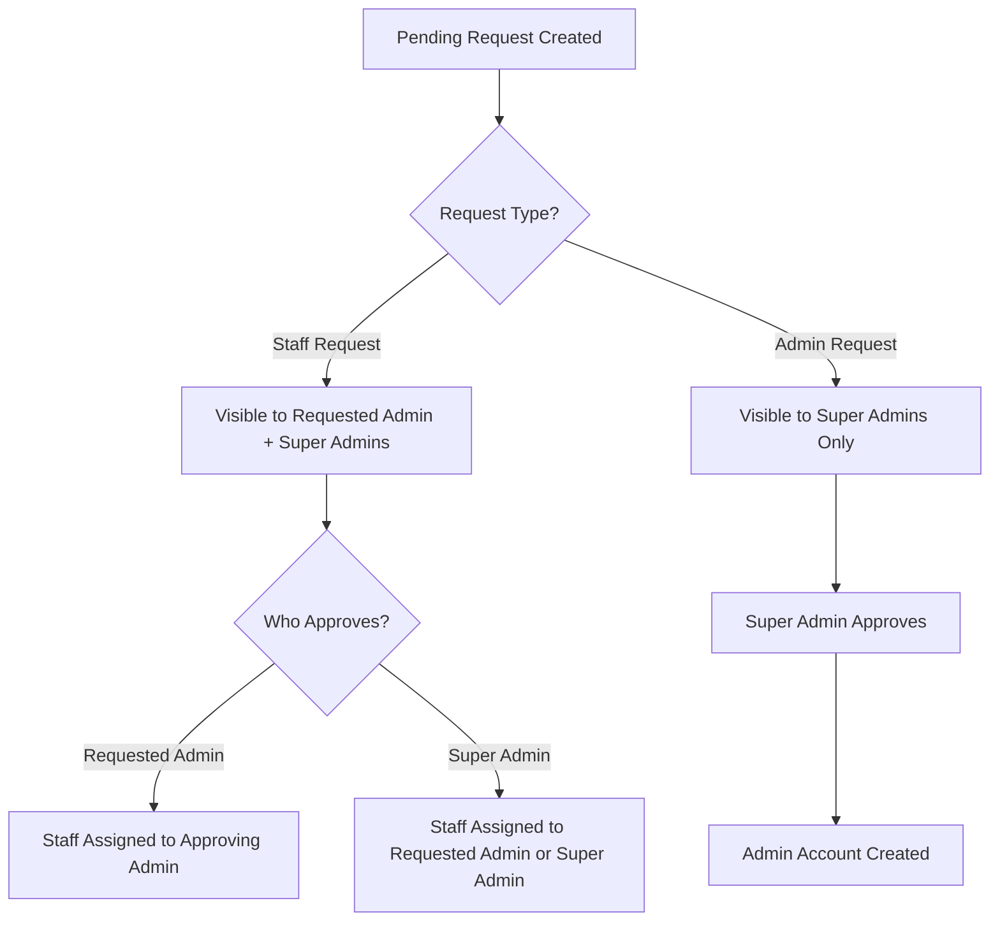
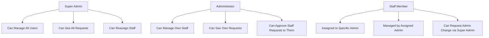

# Staff-Admin Assignment System

## 🏢 **Hierarchical Staff Assignment: Best Practices Implementation**

Following organizational best practices, the system now implements a hierarchical staff assignment model where each staff member belongs to a specific administrator, creating clear reporting relationships and accountability structures.

## 🎯 **Assignment Model**

### **Staff Assignment Rules**
- **Each staff member** is assigned to exactly one administrator
- **Staff requests** are directed to a specific administrator
- **Administrators** can only see and manage their assigned staff
- **Super administrators** can see and manage all staff across all administrators

### **Request Flow**
1. **Staff Role Selection**: User selects "Staff Member" role during registration
2. **Administrator Selection**: User chooses which administrator they want to work under
3. **Targeted Request**: Request is sent specifically to the chosen administrator
4. **Admin Approval**: Only the requested administrator (or super admin) can approve
5. **Assignment Creation**: Upon approval, staff member is assigned to the approving administrator

## 🛡️ **Security & Data Structure**

### **Database Schema Updates**

#### **UserProfile Interface**
```typescript
export interface UserProfile {
  uid: string;
  email: string;
  role: UserRole;
  name: string;
  createdAt: Date;
  lastLogin: Date;
  approvedBy?: string;
  approvedAt?: Date;
  assignedAdminId?: string; // For staff members - which admin they belong to
}
```

#### **PendingUser Interface**
```typescript
export interface PendingUser {
  id: string;
  email: string;
  name: string;
  role: 'admin' | 'staff';
  requestedAt: Date;
  status: 'pending' | 'approved' | 'rejected';
  approvedBy?: string;
  approvedAt?: Date;
  rejectionReason?: string;
  authProvider?: 'email' | 'google';
  requestedAdminId?: string; // For staff requests - which admin they want to be assigned to
}
```

### **New Service Methods**

#### **Admin-Specific Data Retrieval**
```typescript
// Get all administrator users
async getAdminUsers(): Promise<UserProfile[]>

// Get staff assigned to a specific admin
async getStaffForAdmin(adminId: string): Promise<UserProfile[]>

// Get pending requests for a specific admin
async getPendingUsersForAdmin(adminId: string): Promise<PendingUser[]>
```

#### **Enhanced Request Creation**
```typescript
// Create Google user request with admin assignment
async createGoogleUserRequest(
  email: string, 
  name: string, 
  role: UserRole, 
  requestedAdminId?: string
): Promise<string>

// Create regular user request with admin assignment
async requestUserCreation(
  email: string, 
  name: string, 
  role: UserRole = 'staff', 
  requestedAdminId?: string
): Promise<string>
```

## 🎨 **User Experience Enhancements**

### **Google Sign-In Role Selection**

#### **Enhanced Modal Features**
- **Role Selection**: Choose between Staff Member and Administrator
- **Administrator Selection**: For staff requests, choose preferred administrator
- **Dynamic Loading**: Real-time loading of available administrators
- **Clear Messaging**: Explains assignment relationship and approval process

#### **Administrator Selection UI**
```typescript
{selectedRole === 'staff' && (
  <div>
    <Label>Select the administrator you'd like to work under:</Label>
    {adminUsers.map((admin) => (
      <div key={admin.uid} onClick={() => setSelectedAdminId(admin.uid)}>
        <Users className="w-4 h-4" />
        <div>
          <h3>{admin.name}</h3>
          <p>{admin.email}</p>
        </div>
      </div>
    ))}
  </div>
)}
```

### **Admin Panel Experience**

#### **Super Administrator View**
- ✅ **Complete Visibility**: See all pending requests and all users
- ✅ **Global Management**: Can approve any request and manage any user
- ✅ **Assignment Overview**: See which staff are assigned to which admins
- ✅ **Cross-Admin Operations**: Can reassign staff between administrators

#### **Administrator View**
- ✅ **Targeted Requests**: Only see staff requests directed to them
- ✅ **Assigned Staff**: Only see staff members assigned to them
- ✅ **Peer Visibility**: Can see other administrators (for collaboration)
- ❌ **Limited Scope**: Cannot see staff assigned to other administrators
- ❌ **No Cross-Admin Access**: Cannot approve requests for other administrators

#### **Data Loading Logic**
```typescript
if (userRole === 'super_admin') {
  // Super admins see everything
  const [users, visibleUsers, admins] = await Promise.all([
    authService.getPendingUsers(),
    authService.getVisibleUsers(userRole),
    authService.getAdminUsers()
  ]);
} else {
  // Regular admins see only their domain
  const [pendingForAdmin, staffForAdmin, allVisibleUsers, admins] = await Promise.all([
    authService.getPendingUsersForAdmin(currentUser.uid),
    authService.getStaffForAdmin(currentUser.uid),
    authService.getVisibleUsers(userRole),
    authService.getAdminUsers()
  ]);
}
```

## 🔍 **Assignment Process Flow**

### **1. Staff Registration (Google Sign-In)**


### **2. Request Approval Process**


### **3. User Management Hierarchy**


## 📊 **Benefits of Hierarchical Assignment**

### **Organizational Benefits**
- **Clear Reporting Structure**: Each staff member has a defined supervisor
- **Distributed Management**: Admins handle their team without super admin intervention
- **Accountability**: Clear responsibility chains for staff management
- **Scalability**: System grows efficiently with organizational structure

### **Security Benefits**
- **Data Isolation**: Admins only see their assigned staff
- **Reduced Access**: Limits exposure of staff information
- **Targeted Permissions**: Requests go to appropriate approvers
- **Audit Trail**: Clear tracking of who manages whom

### **User Experience Benefits**
- **Personalized Requests**: Staff can choose their preferred administrator
- **Faster Approvals**: Requests go directly to relevant admin
- **Clear Relationships**: Users understand their organizational position
- **Efficient Management**: Admins focus on their team only

## 🔧 **Implementation Details**

### **Assignment Logic**
```typescript
// When creating staff accounts
const profile: UserProfile = {
  // ... other fields
  assignedAdminId: role === 'staff' ? createdBy : undefined
};

// When approving staff requests
const profile: UserProfile = {
  // ... other fields
  assignedAdminId: pendingUser.role === 'staff' 
    ? (pendingUser.requestedAdminId || approverUid) 
    : undefined
};
```

### **Data Filtering**
```typescript
// Admin sees only their staff
const staffForAdmin = await authService.getStaffForAdmin(adminId);

// Admin sees only requests to them
const pendingForAdmin = await authService.getPendingUsersForAdmin(adminId);

// Super admin sees everything
const allUsers = await authService.getAllUsers();
const allPending = await authService.getPendingUsers();
```

### **UI Adaptations**
- **Role-based data loading**: Different queries based on user role
- **Contextual messaging**: Explains assignment relationships
- **Administrator selection**: Interactive admin picker for staff requests
- **Assignment indicators**: Shows which admin staff belong to

## 🚨 **Security Considerations**

### **Access Control**
- **Horizontal Privilege Separation**: Admins cannot access other admins' staff
- **Vertical Privilege Escalation**: Only super admins can manage admins
- **Request Targeting**: Staff requests only visible to intended recipients
- **Assignment Immutability**: Staff assignments can only be changed by super admins

### **Data Privacy**
- **Need-to-Know Basis**: Admins only see relevant staff information
- **Request Privacy**: Pending requests only visible to authorized approvers
- **Assignment Transparency**: Clear indication of reporting relationships
- **Audit Logging**: Complete tracking of assignment changes

## 📈 **Future Enhancements**

### **Potential Features**
- **Staff Reassignment**: Super admin interface to move staff between admins
- **Team Analytics**: Performance metrics for admin teams
- **Workload Balancing**: Automatic distribution of staff requests
- **Department Integration**: Link assignments to organizational departments
- **Delegation**: Temporary assignment of admin responsibilities

### **Scalability Considerations**
- **Large Organizations**: Efficient queries for thousands of users
- **Multi-Level Hierarchy**: Support for manager-admin-staff structures
- **Geographic Distribution**: Location-based admin assignments
- **Specialization**: Skill-based staff-admin matching

This hierarchical staff assignment system provides a robust foundation for organizational user management while maintaining security, scalability, and user experience best practices.